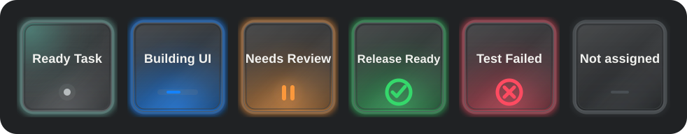

# Codex Deck

Codex Deck brings the Codex Micro control model to an Elgato Stream Deck. It mirrors Codex's six native agent slots and sends Codex's own Micro events for actions, joystick directions, encoder clicks, reasoning effort, and official keycap commands. It does not type text or depend on global hotkeys.

> [!IMPORTANT]
> This is an independent community project. It is not made, supported, or endorsed by OpenAI or Elgato. It uses undocumented Codex desktop internals and may need an update after a Codex release.



## Choose your setup

The same Stream Deck plugin package works in all three modes. Install only the launcher and configuration needed for your setup.

| Setup | Stream Deck software | Codex controlled | Guide |
|---|---|---|---|
| Windows only | Windows | Local Windows Codex | [Windows setup](docs/WINDOWS.md) |
| Mac only | macOS | Local Mac Codex | [macOS setup](docs/MACOS.md) |
| Windows + Mac | Windows | Both apps; six agents are merged | [Multi-host setup](docs/MULTI_HOST.md) |

Windows-only and Mac-only mode have no relay, no second computer dependency, and no host badges. Multi-host mode is optional and can be disabled without changing the local bridge on either machine.

## Features

- Six dynamic agent keys using the source and assignments selected in **Codex Settings > Codex Micro**.
- Live idle, working, unread completion, approval/input, error, and empty states.
- Codex-aligned light and dark rendering with restrained status animation.
- Native key-down/key-up handling for Micro slots `ACT06` through `ACT12`.
- Native joystick up, right, down, left, and encoder click.
- Dedicated reasoning-effort up/down buttons with press-and-hold repeat.
- A local `codex://threads/new` action for a new task.
- Standalone actions for all official single-size keycaps, resolved from the installed Codex build at runtime.
- Optional local loading of official keycap SVGs; those protected files are never included in this repository or its releases.
- Optional authenticated SSH/Tailscale relay for one Stream Deck controlling Windows and Mac Codex together.

## Requirements

- Codex desktop on the computer being controlled.
- Elgato Stream Deck 6.6 or newer on the computer connected to the Stream Deck.
- Node.js 20 or newer for the platform launcher.
- Windows 10+ or macOS 13+.
- Tested hardware: standard 15-key Stream Deck MK.2.

Other Stream Deck models may work, but the included layout and physical-device testing target the normal 5×3 MK.2.

## Quick install

1. Download `com.simeo.codex-deck.streamDeckPlugin` from the matching [GitHub release](https://github.com/dazer1234/codex-stream-deck/releases/latest) and open it on the computer running Stream Deck.
2. Download only the launcher for that computer:
   - Windows: `codex-deck-launcher-windows-vX.Y.Z.zip`
   - macOS: `codex-deck-launcher-macos-vX.Y.Z.zip`
3. Follow [Windows](docs/WINDOWS.md), [macOS](docs/MACOS.md), or [Windows + Mac](docs/MULTI_HOST.md).
4. In **Codex Settings > Codex Micro**, choose the agent source, action assignments, joystick actions, and encoder behavior.
5. Build the two Stream Deck pages below.

In Windows + Mac mode, choose the same agent-source mode in both Codex apps when you want both native Pinned lists or both sets of Individual assignments to contribute. Pinned tasks are interleaved fairly. For Individual assignments, the Stream Deck computer wins when both apps assign different tasks to one button, while the other computer fills empty slots. Mirrored copies of the same task are shown only once. See [Multi-host behavior](docs/MULTI_HOST.md#agent-source-modes).

## Recommended 15-key layout

This is the actual polished two-page layout used for the MK.2. It keeps the six live agents on the main page and puts lower-frequency navigation/reasoning controls on page 2.

> This layout is only a recommendation and a practical starting point. Every action, position, page, and profile can be customized freely to match your own workflow; Codex Deck does not require this exact arrangement.

### Page 1 — agents and daily actions

| Agent 1 | Agent 2 | Agent 3 | Agent 4 | Agent 5 |
|---|---|---|---|---|
| Agent 6 | Action 1 / Fast | Action 2 / Approve | Action 3 / Reject | Action 4 / Fork |
| Action 5 / Push-to-talk | Keycap · Browser¹ | Stream Deck: Next Page | Reasoning Encoder Click | New Task |

The action names describe the default Codex Micro setup. The keys always follow the live `ACT06`, `ACT07`, `ACT08`, `ACT09`, and `ACT10/11` assignments selected in Codex. ¹If you use `ACT12` / Send more often than Browser, put **Action 6 / Send** in that position instead.

### Page 2 — navigation and reasoning

| Windows / Mac Target² | Empty | Joystick Up / Plan | Reasoning Down | Reasoning Up |
|---|---|---|---|---|
| Empty | Joystick Left / Back | Stream Deck: Previous Page | Joystick Right / Forward | Reasoning Encoder Click |
| Stream Deck: Switch Profile³ | Empty | Joystick Down / Sidebar | Empty | New Task |

²Use the target key only in Windows + Mac mode. In a single-computer setup, leave it empty or replace it with another keycap action. ³Configure Stream Deck's built-in **Switch Profile** action to return to your own standard profile; no user-specific profile ID is distributed.

The page-navigation and profile-switch keys are built-in Stream Deck actions. All other named controls come from Codex Deck. Every official Codex Micro keycap is also exposed as a standalone action, so extra pages can be customized without changing the six synchronized Micro action slots.

## Official keycap SVGs are not included

The public source and release intentionally exclude OpenAI's Codex Micro keycap SVG files. The original agent tiles, status marks, glow system, animations, fallback labels, and plugin artwork are included.

If you have the right to use the files already present in your own Codex installation, copy them outside the repository to:

```text
Windows: %LOCALAPPDATA%\CodexDeck\icons
macOS:   ~/Library/Application Support/CodexDeck/icons
```

Name each copy after its Codex keycap ID, such as `FAST.svg`, `APPR.svg`, `REJ.svg`, `SPLIT.svg`, or `MIC.svg`. Codex can inspect your local installation and copy the exact existing SVG files for you when explicitly instructed not to redraw, download, upload, publish, or commit them. See [Local icon setup](docs/ICON_SETUP.md) for the guarded workflow and complete filename list.

## How it works

```text
Stream Deck key
    -> Codex Deck plugin
    -> loopback-only Chrome DevTools connection
    -> Codex renderer host-event bus
    -> native Codex Micro handler
```

The launcher enables a random Chrome DevTools port bound to `127.0.0.1`. The plugin discovers version-hashed renderer modules, reads the native Micro layout/state, and dispatches the same event families used by the Micro integration:

- `codex-micro-device-state-changed`
- `codex-micro-hid-event`
- `codex-micro-joystick-event`

No virtual HID driver is installed and no Codex application file is patched. See [Architecture and security](docs/ARCHITECTURE.md).

## Security and privacy

- The Codex debug endpoint remains loopback-only and is never the multi-host relay endpoint.
- CDP is privileged: another untrusted process running as the same local user could try to access it.
- Codex Deck has no telemetry, cloud service, or update service.
- Single-host mode reads no rollout data. Multi-host mode reads only exact local rollout **filenames**, never their contents, to distinguish a task's owning desktop from a cloud/SSH mirror.
- Optional SVGs stay in the user-local icons directory and are never uploaded.
- Multi-host mode accepts only authenticated, typed Codex Deck commands over SSH or Tailscale; wildcard and arbitrary public-IP listeners are rejected.
- Private relay tokens, local host state, logs, and personal paths are excluded by the release audit.

Do not use the launcher while running untrusted local software. See [SECURITY.md](SECURITY.md).

## Compatibility

The current build was locally validated against:

- Codex for Windows `26.715.4045.0`
- Codex for macOS `26.715.31925`
- Stream Deck `7.4.2.22730`
- Windows `10.0.26220.0`
- Node.js `24.13.0`
- Standard 15-key Stream Deck MK.2

The Windows physical-device path and the Windows+Mac relay were exercised on the real setup. The macOS launcher, watcher, native bridge, and plugin package are validated; a Stream Deck physically attached to the Mac has not yet been hardware-tested. These are tested versions, not strict maximums.

## Troubleshooting

Start with [Troubleshooting](docs/TROUBLESHOOTING.md). The important rule is: restart only the Stream Deck plugin/app for plugin updates. Do not restart Codex unless the launcher explicitly says an unbridged Codex generation needs one recovery restart and you choose to proceed.

## Build and release validation

```powershell
npm ci
npm run check
npm test
npm run validate
npm run pack
npm run audit:release
```

`npm run release:prepare` creates a versioned local release-candidate directory with the plugin package, Windows launcher ZIP, and SHA-256 checksums. The macOS ZIP must be created on macOS with `scripts/package-macos-release.sh` so executable bits survive; pass that ZIP to `scripts/prepare-release.ps1 -MacArchivePath ...`.

Nothing is published automatically. See [CONTRIBUTING.md](CONTRIBUTING.md).

## License and trademarks

Code and original artwork are licensed under [MIT](LICENSE). OpenAI, Codex, ChatGPT, Elgato, Stream Deck, and their marks/assets belong to their respective owners; third-party and user-supplied assets are not relicensed.
