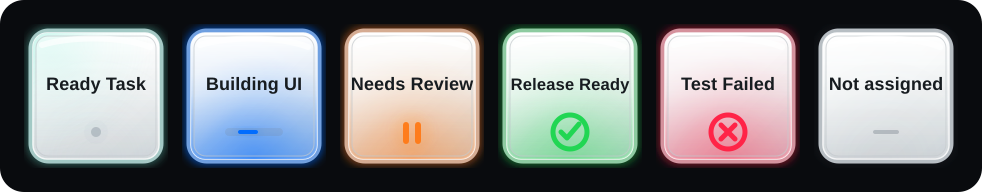

# Codex Deck

An unofficial, Windows-only bridge that brings the Codex Micro control model to an Elgato Stream Deck.

Codex Deck mirrors the six native agent slots, their live states, the six configurable Micro action slots, joystick directions, encoder click, and reasoning-effort controls. It sends Codex's own renderer events instead of typing text or relying on global hotkeys.

> [!IMPORTANT]
> This is an independent community project. It is not made, supported, or endorsed by OpenAI or Elgato. It relies on undocumented Codex desktop internals and may need an update after a Codex release.



## What works

- Six dynamic agent keys using the assignments selected in **Codex Settings > Codex Micro**.
- Live states: idle, working, unread completion, approval/input required, error, and empty.
- Native key-down and key-up events for Micro action slots `ACT06` through `ACT12`.
- Native joystick events for up, right, down, and left.
- Native encoder click.
- Dedicated reasoning-effort up/down buttons with press-and-hold repeat.
- A direct `codex://threads/new` action for starting a new task.
- Optional local loading of Codex Micro keycap SVGs without redistributing those files.

There is deliberately no legacy task-database reader, log scraper, or hotkey fallback in the public runtime.

## Requirements

- Windows 10 or newer.
- The Codex desktop app for Windows.
- Elgato Stream Deck 6.6 or newer.
- Node.js 20 or newer for the launcher.
- Tested hardware: the standard 15-key Stream Deck MK.2.

Other 15-key Stream Deck models may work, but have not been verified yet.

## Install

1. Open the latest [GitHub release](https://github.com/dazer1234/codex-stream-deck/releases/latest).
2. Download and double-click `com.simeo.codex-deck.streamDeckPlugin`.
3. Download and extract `codex-deck-launcher-v0.4.1.zip`.
4. Close Codex, then double-click **Start Codex Deck.cmd** from the extracted launcher folder.
5. Open **Codex Settings > Codex Micro** and choose the agent source, action assignments, joystick actions, and encoder behavior you want.
6. In Stream Deck, drag the Codex Deck actions onto your keys using the layout below.

Use **Start Codex Deck.cmd** whenever you want to use the bridge. A normally launched Codex session does not expose the local connection the plugin needs.

## Recommended 15-key layout

Page 1:

| Agent 1 | Agent 2 | Agent 3 | Agent 4 | Agent 5 |
|---|---|---|---|---|
| Agent 6 | Action 1 | Action 2 | Action 3 | Action 4 |
| Action 5 | Action 6 | Stream Deck: Next Page | Encoder Click | New Task |

The six action keys follow whatever is assigned to `ACT06`, `ACT07`, `ACT08`, `ACT09`, `ACT10/11`, and `ACT12` in the Codex Micro settings. Names such as Fast, Approve, Reject, Fork, Push-to-talk, and Send are defaults, not hardcoded behavior.

Page 2:

| Joystick Up | Reasoning Down | Encoder Click | Reasoning Up | New Task |
|---|---|---|---|---|
| Empty | Joystick Left | Stream Deck: Previous Page | Joystick Right | Empty |
| Empty | Empty | Joystick Down | Empty | Empty |

The page-navigation keys are built-in Stream Deck actions, not Codex Deck actions.

## Official keycap SVGs are not included

The repository and release intentionally do **not** contain OpenAI's Codex Micro command/keycap SVG files. The original agent-tile renderer, glow system, animations, and status marks are included under the repository license.

If you have the right to use the official keycap files from your own local Codex installation, place them in:

```text
%LOCALAPPDATA%\CodexDeck\icons
```

Rename each file to its Codex keycap ID, for example `FAST.svg`, `APPR.svg`, `REJ.svg`, `SPLIT.svg`, or `MIC.svg`. When a local file matches the keycap selected in Codex settings, Codex Deck renders it automatically on the corresponding six action keys. Nothing from this folder is uploaded or committed.

For a careful local extraction workflow and a ready-to-copy Codex prompt, see [Local icon setup](docs/ICON_SETUP.md).

## How it works

```text
Stream Deck key
    -> Codex Deck plugin
    -> loopback-only Chrome DevTools connection
    -> Codex renderer host-event bus
    -> native Codex Micro handler
```

The launcher starts the installed Codex app with a random debug port bound to `127.0.0.1`, records that port in `%LOCALAPPDATA%\CodexDeck\codex-micro-bridge.json`, and enables the Micro UI for that session. The plugin discovers version-hashed renderer modules at runtime, reads the native Micro slot/layout state, and dispatches the same three event families used by the Micro integration:

- `codex-micro-device-state-changed`
- `codex-micro-hid-event`
- `codex-micro-joystick-event`

See [Architecture and security](docs/ARCHITECTURE.md) for the full boundary.

## Security and privacy

- The bridge listens on loopback only; it is not intentionally exposed to your network.
- Chrome DevTools access is powerful. Any untrusted process running as your Windows user could attempt to access the local port while that Codex session is open.
- The plugin sends no telemetry and has no cloud service.
- The public runtime does not read Codex task databases, rollout files, or desktop logs.
- Local icon SVGs are read only from `%LOCALAPPDATA%\CodexDeck\icons`.
- Closing the launcher-started Codex session closes the debug endpoint.

Do not use the launcher on a machine where you run untrusted local software. See [SECURITY.md](SECURITY.md) before reporting a vulnerability.

## Compatibility

The initial public release was verified with:

- Codex for Windows `26.707.12708.0`
- Stream Deck `7.4.2.22730`
- Windows build `10.0.26220.0`
- Node.js `24.13.0`
- Standard 15-key Stream Deck MK.2

These are tested versions, not strict minimums. Because Codex Deck uses undocumented renderer internals, newer Codex versions can break compatibility even when the Stream Deck plugin itself still loads.

## Troubleshooting

Start with [Troubleshooting](docs/TROUBLESHOOTING.md). The quickest checks are:

1. Run `Start-CodexDeck.ps1 -DryRun` from PowerShell.
2. Confirm `%LOCALAPPDATA%\CodexDeck\codex-micro-bridge.json` exists after launch.
3. Confirm Codex Settings shows **Codex Micro**.
4. Restart Stream Deck after installing or updating the plugin.
5. Check Stream Deck logs for `Native Codex-Micro bridge connected`.

## Uninstall

1. Remove **Codex Deck** from Stream Deck's plugin settings.
2. Close Codex and launch it normally.
3. Delete `%LOCALAPPDATA%\CodexDeck` if you also want to remove the port file and local icon copies.
4. Delete the extracted launcher folder.

The launcher does not patch files inside the Codex installation.

## Build from source

```powershell
npm ci
npm run check
npm test
npm run validate
npm run pack
```

Outputs:

- Plugin bundle: `dist/com.simeo.codex-deck.sdPlugin`
- Launcher folder: `release/codex-deck-launcher`
- Installable plugin package: `com.simeo.codex-deck.streamDeckPlugin`

See [CONTRIBUTING.md](CONTRIBUTING.md) before opening a pull request.

## Trademarks and assets

OpenAI, Codex, ChatGPT, and related marks and assets belong to OpenAI. Elgato and Stream Deck belong to their respective owner. This repository's code and original project artwork are licensed under MIT; third-party marks and user-supplied assets are not relicensed.

- [OpenAI brand guidelines](https://openai.com/brand/)
- [Elgato Stream Deck plugin distribution documentation](https://docs.elgato.com/streamdeck/sdk/v1/introduction/distribution/)

## License

[MIT](LICENSE)
